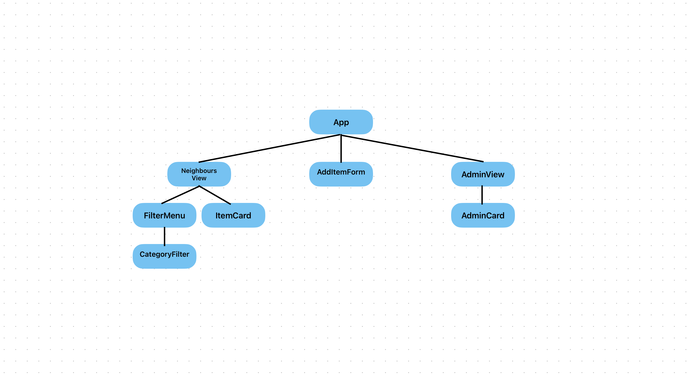

# Knock

## About KNOCK

Knock! was developed as an MVP project while studying on the Full Stack Development bootcamp at CodeOp. Knock! is a platform that facilitates sharing useful tools and household items amongst neighbours, encouraging users to buy less and connect with their local community.

## Getting Started

Follow the steps below to install your dependencies and start your server:

In your terminal, `cd server` and then:

`npm install` to install packages.
`npm run migrate` to set up the databas

Then, run `npm start` inside your `server` folder to start your back-end server.

In a different terminal, navigate to your main project folder (`my-mvp`) and `cd client`. Then, `npm run dev` to run your client.

## Set up explained

### 1. Database

The database is set up to hard code 6 items and 3 users when you run `npm run migrate`.

### 2. Routes

Check the itemsController.js file in server > controllers and the index.js file in server > routes to see all routes already available to use. You can add more routes if needed using these two files.

### 3. Components

I have created this diagram to help you visualise how all the components relate to eachother.

## Feature Extension ideas

Below are some ideas for feature extensions:

- Improved error control (e.g. new item form)
- Filter by type (borrow/request)
- Option to edit an item card, for example changing the title, description, image, etc.
- Authentication/option to register as a user and log in
- In-app messaging
- Option to create a neighbourhood and add users to it

## Notes

_This is a student project that was created at [CodeOp](http://CodeOp.tech), a full stack development bootcamp in Barcelona._
